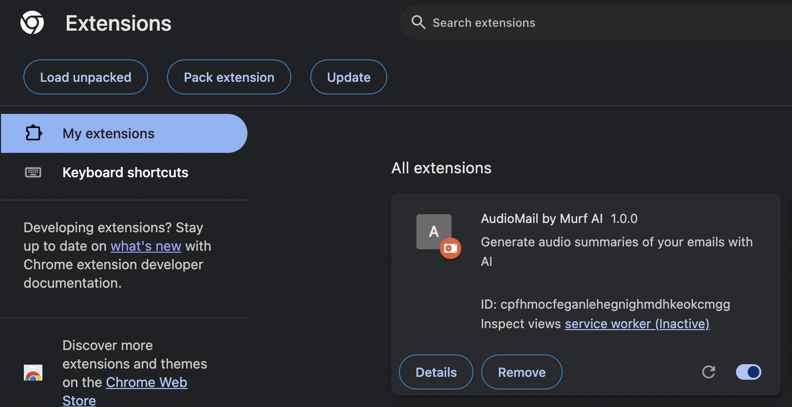
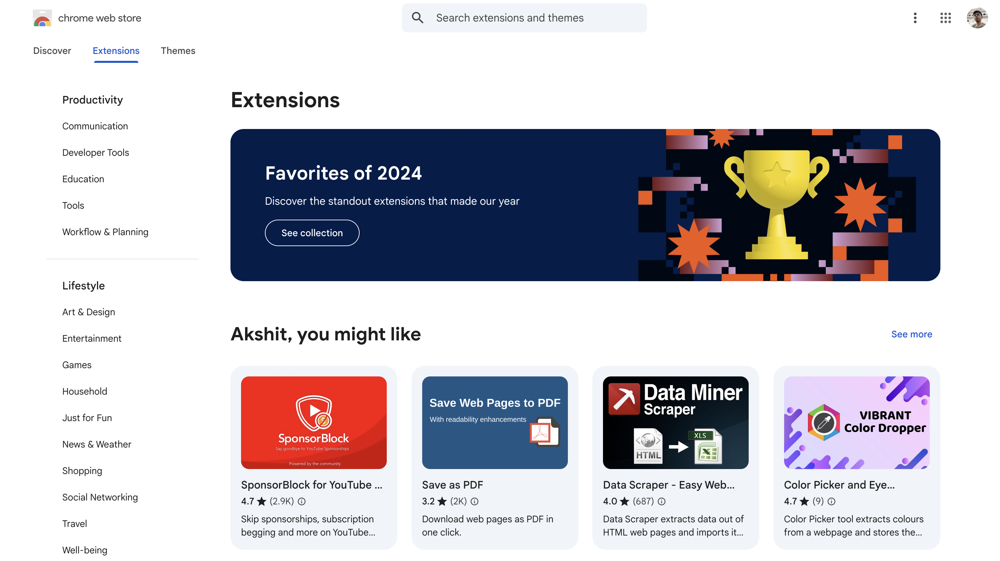
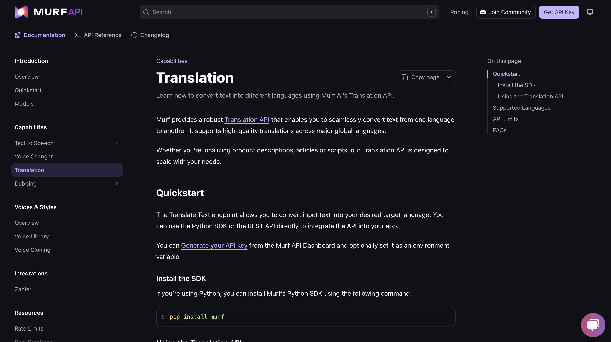

# Building an AI-Powered Email Reader: A Developer's Guide

Imagine having your inbox read to you in natural-sounding audio with concise AI summaries. In this tutorial, we'll build a Chrome extension that transforms Gmail into an audio experience - perfect for busy professionals, commuters, or anyone who wants to consume their emails hands-free.


## **Table of Contents**

1. Setting the goal
2. Technology Stack
3. Backend Setup
    - Prerequisites
    - Setting Up the Project Structure
    - Environment Configuration
    - Dependency Management
    - Core Application Components
        - Data Models
        - Configuration Management
        - AI Services Layer
        - Business Logic Controller
        - API Routes
        - Main Application
4. Docker Deployment
5. Testing the API
6. Frontend Development
    - Project Structure
    - Manifest Configuration
    - Background Script
    - Content Scripts
    - Popup Interface
7. Resources
8. Next Steps & Scaling up
9. Conclusion

## Setting the Goal

Our goal is to create a Chrome extension that seamlessly integrates with the user’s Gmail inbox, reads the opened email, summarizes it, and provides a playable audio file. The experience should be fast and simple. Here is a short clip demonstrating what needs to be built: [


[](https://www.youtube.com/watch?v=W9M1kPgfCs0)

## **Technology Stack**

Here's a clear breakdown of the technology stack:

| **Component** | **Technologies** |
| --- | --- |
| Frontend | HTML, CSS, JavaScript (Vanilla), Manifest 3 (Chrome Extension) |
| Backend | FastAPI (Python), Langchain, GPT 4o / Gemini Flash 2.0, Murf AI (Text to Speech), Docker |

## **Backend Setup**

This section guides you through building a FastAPI server that processes emails using AI for summarisation and text-to-speech conversion. We'll cover everything from setting up the project structure to deploying with Docker.

### **Prerequisites**

Before you begin, ensure you have the following:

- Python 3.8+
- API Keys and Accounts:
    - [OpenAI API Key](https://platform.openai.com/signup) - For GPT-4 access
    - [Google AI Studio](https://makersuite.google.com/app/apikey) - For Gemini API access
    - [Murf AI Account](https://murf.ai/signup) - For text-to-speech conversion
- [Langchain Documentation](https://python.langchain.com/docs/get_started/introduction) - For understanding the LLM framework
- Docker (optional, for containerised deployment)

### **Step 1: Setting Up the Project Structure**

Before we start coding, we need to organize our project in a way that follows clean architecture principles. This structure will help us:

- Separate concerns (backend logic, API routes, services, etc.)
- Make the code more maintainable and testable
- Follow industry best practices for FastAPI applications
- Make it easier to add new features in the future

Our project will be organised into the following main components:

- `app/`: Core application code
    - `routers/`: API endpoint definitions
    - `models/`: Data models and validation
    - `services/`: Business logic and external integrations
    - `controllers/`: Mediates between routes and services
    - `utils/`: Helper functions
- Root files: Dockerfile, requirements.txt, etc.

Now, let's create this structure:

```bash
mkdir email_reader_ai
cd email_reader_ai
mkdir -p server/app/{routers,utils,services,models,controllers}
```

This structure promotes separation of concerns, making the code easier to maintain, test, and scale.

### **Step 2: Environment Configuration**

We use **`.env`** file to manage configuration:

```powershell
# API Keys
OPENAI_API_KEY=your_openai_api_key
GEMINI_API_KEY=your_gemini_api_key
MURF_API_KEY=your_murf_api_key

# Server Configuration
PORT=8000
HOST=0.0.0.0
DEBUG=False
```

**Best Practices:**

- Never commit **`.env`** to version control
- Use **`.env.example`** to document required variables
- Load environment variables at application startup

### **Step 3: Dependency Management**

Our **`requirements.txt`** specifies all Python dependencies:

```powershell
# FastAPI and server
fastapi==0.109.2
uvicorn==0.27.1

# AI components
langchain==0.1.9
langchain-google-genai==0.0.11
langchain-openai==0.0.8

# Other utilities
python-dotenv==1.0.1
pydantic==2.6.1

```

**Key Dependencies:**

- **`fastapi`**: Modern, fast web framework
- **`uvicorn`**: ASGI server for running FastAPI
- **`langchain`**: Framework for working with LLMs
- **`pydantic`**: Data validation and settings management

### **Step 4: Core Application Components**

### **4.1 Data Models**

Data models are crucial for our application as they define the structure and validation rules for our data. In our email reader application, we need to handle email data in a structured way. Let's look at the key data model:

### **EmailData Model**

The `EmailData` model is the core data structure that represents an email in our system. It serves several important purposes:

- Validates incoming email data
- Ensures required fields are present
- Sanitizes input data
- Provides type safety through Pydantic

This model is used throughout our application:

- In API endpoints to validate incoming requests
- In services to process email content
- In controllers to pass data between layers
- For consistent data structure across the application

Here's the implementation:

```python
from pydantic import BaseModel, Field, validator

class EmailData(BaseModel):
    subject: str = Field(..., min_length=1)
    sender: str = Field(..., min_length=1)
    body: str = Field(..., min_length=1)

    @validator('*')
    def remove_whitespace(cls, v):
        if isinstance(v, str):
            return v.strip()
        return v

    @validator('body')
    def validate_body_length(cls, v):
        if len(v) < 10:
            raise ValueError('Email body too short')
        return v

```

Let's break down the key components of this model:

1. **Field Definitions:**
    - `subject`: Email subject line (required, non-empty)
    - `sender`: Email sender address (required, non-empty)
    - `body`: Email content (required, non-empty)
2. **Validators:**
    - `remove_whitespace`: Ensures no leading/trailing whitespace
    - `validate_body_length`: Ensures email body has meaningful content
3. **Validation Rules:**
    - All fields are required (using `...`)
    - Minimum length of 1 character for all fields
    - Body must be at least 10 characters long

### **4.2 AI Services Layer**

The AI Services Layer is responsible for handling all AI-related operations in our application. This includes:

- Email summarization using LLMs
- Text-to-speech conversion
- Integration with external AI services

### **Langchain Service**

The Langchain service is responsible for handling interactions with different LLM providers (Gemini and OpenAI). Here's a breakdown of its key components:

1. **Model Provider Setup** First, we set up the necessary imports and define our model provider options. This includes importing required libraries and creating an enum to manage different LLM providers (Gemini and OpenAI) in a type-safe way.

```python
from langchain_google_genai import ChatGoogleGenerativeAI
from langchain_openai import ChatOpenAI
import os
from app.models.email import EmailData
from typing import Dict, Union
from enum import Enum
from dotenv import load_dotenv

# Load environment variables
load_dotenv()

class ModelProvider(Enum):
    GEMINI = "gemini"
    OPENAI = "openai"

```

1. **Service Initialization** The service initialization sets up the core configuration and prepares the LLM for use. It handles provider selection, sets default parameters for token limits and temperature, and initializes the appropriate LLM based on the chosen provider.

```python
class LangchainService:
    def __init__(self, model_provider: Union[ModelProvider, str] = ModelProvider.GEMINI):
# Handle string inputif isinstance(model_provider, str):
            try:
                model_provider = ModelProvider(model_provider.lower())
            except ValueError:
                raise ValueError(f"Invalid model provider: {model_provider}. Use 'gemini' or 'openai'")

        self.model_provider = model_provider

# Common configuration
        self.max_tokens = 500 # Reasonable summary length
        self.temperature = 0.3 # Lower temperature for consistent summaries

# Initialize LLM based on provider
        self.llm = self._initialize_llm()

```

1. **LLM Initialization** This section handles the initialization of specific LLM providers. It includes separate methods for Gemini and OpenAI, each with their own configuration and API key management. The code ensures proper error handling and validation of API keys.

```python
    def _initialize_llm(self):
        if self.model_provider == ModelProvider.GEMINI:
            return self._initialize_gemini()
        elif self.model_provider == ModelProvider.OPENAI:
            return self._initialize_openai()
        else:
            raise ValueError(f"Unsupported model provider: {self.model_provider}")

    def _initialize_gemini(self):
        gemini_api_key = os.getenv('GEMINI_API_KEY')
        if not gemini_api_key:
            raise ValueError("Gemini API key is required. Set GEMINI_API_KEY in env")

        self.model_name = "gemini-2.0-flash-001"

        return ChatGoogleGenerativeAI(
            model=self.model_name,
            max_tokens=self.max_tokens,
            temperature=self.temperature,
            google_api_key=gemini_api_key,
            top_p=0.8,
            top_k=40,
        )

    def _initialize_openai(self):
        openai_api_key = os.getenv('OPENAI_API_KEY')
        if not openai_api_key:
            raise ValueError("OpenAI API key is required. Set OPENAI_API_KEY environment variable.")

        self.model_name = "gpt-4o"

        return ChatOpenAI(
            model=self.model_name,
            max_tokens=self.max_tokens,
            temperature=self.temperature,
            openai_api_key=openai_api_key,
        )

```

1. **Email Processing and Summarization** This is the core functionality of the service. It handles the email summarization process, including prompt creation, validation, and error handling. The code ensures proper formatting of the email content and manages the interaction with the LLM.

```python
    def create_summary_prompt(self, email_data: EmailData) -> str:
        prompt = f"""Please provide a concise summary of this email. Focus on the main purpose, key information, and any required actions.

Subject: {email_data.subject}
Sender: {email_data.sender}
Email Body: {email_data.body}

Please summarize this email in 2-3 clear sentences that capture:
1. The main purpose or reason for the email
2. Key information or important details
3. Any actions required or deadlines mentioned

Summary:"""
        return prompt

    def summarize_email(self, subject: str, sender: str, body: str) -> str:
        try:
            email_data = EmailData(subject=subject, sender=sender, body=body)

# Validate and process email
            validation = self._validate_email_data(email_data)
            if not validation["valid"]:
                if "suggestion" in validation:
                    return {
                        "success": True,
                        "summary": validation["suggestion"],
                        "provider": self.model_provider.value,
                        "model": "short_email_handler"
                    }
                return {
                    "success": False,
                    "error": validation["error"]
                }

# Handle long content and create summary
            email_data = self._handle_long_content(email_data)
            prompt = self.create_summary_prompt(email_data)

            messages = [
                ("system", "You are a helpful email summarization assistant. Provide clear, concise summaries that capture the essential information and any required actions."),
                ("human", prompt),
            ]

            response = self.llm.invoke(messages)
            return response.content.strip()

        except Exception as e:
            return self._handle_provider_errors(str(e))

```

### **MurfAI Service**

The MurfAI service handles text-to-speech conversion using the Murf AI API. Here's how it works:

1. **Service Initialization** The initialization process sets up the MurfAI client with proper API key management. It supports both direct API key injection and environment variable usage, with appropriate error handling for missing credentials.

```python
from murf import Murf
import os
from dotenv import load_dotenv

load_dotenv()

class MurfAIService:
    def __init__(self, api_key: str = None):
        self.api_key = api_key or os.getenv('MURF_API_KEY')
        if not self.api_key:
            raise ValueError("MURF_API_KEY is required. Set it in environment variables or pass it to the constructor.")

        self.client = Murf(api_key=self.api_key)
        self.default_voice = "en-US-natalie"

```

1. **Text-to-Speech Conversion** This is the core functionality that converts text to speech. It handles voice selection, input validation, and audio generation with high-quality settings. The method includes comprehensive error handling and ensures the output meets our quality standards.

```python
    async def text_to_speech(self, text: str, voice_id: str = None) -> str:
        try:
            voice = voice_id or self.default_voice

# Ensure text is a stringif not isinstance(text, str):
                text = str(text)

            response = self.client.text_to_speech.generate(
                text=text,
                voice_id=voice,
                format="MP3",
                channel_type="STEREO",
                sample_rate=44100
            )

            if not response or not response.audio_file:
                raise Exception("No audio file generated")

            return response.audio_file

        except Exception as e:
            raise Exception(f"Error in text-to-speech conversion: {str(e)}")

```

**Key Features of the Service:**

1. **Voice Configuration:**
    - Configurable voice selection
    - Default voice fallback
    - Support for multiple voice options
2. **Audio Quality:**
    - High-quality MP3 format
    - Stereo channel output
    - 44.1kHz sample rate for optimal quality
3. **Error Handling:**
    - API key validation
    - Input type checking
    - Response validation
    - Detailed error messages
4. **Flexibility:**
    - Environment variable support
    - Direct API key injection
    - Custom voice selection
    - Async operation support

### **4.3 Business Logic Controller**

The `EmailSummariserController` is the central component that orchestrates the interaction between our AI services. It manages the flow of data and ensures proper error handling throughout the email processing pipeline.

1. **Controller Setup and Dependencies** The initialisation process sets up the necessary services and establishes the foundation for email processing. It creates instances of both the MurfAI and Langchain services, which will be used for text-to-speech conversion and email summarization respectively.

```python
from app.models.email import EmailData
from app.services.murfai_service import MurfAIService
from app.services.langchain_service import LangchainService
from fastapi import HTTPException
from typing import Dict, Any
from app.utils.logging import logger

class EmailSummarizerController:
    def __init__(self):
        self.murf_service = MurfAIService()
        self.langchain_service = LangchainService()

```

1. **Email Processing Logic** This is the core functionality that processes emails through our AI pipeline. It handles the complete flow from email data to final audio output, including:
- Logging for monitoring and debugging
- Email summarization using Langchain
- Text-to-speech conversion using MurfAI
- Comprehensive error handling
- Response formatting

```python
    async def summarize_email(self, email_data: EmailData) -> Dict[str, Any]:
        try:
# Log incoming email data
            logger.info(f"Subject - {email_data.subject}")
            logger.info(f"Sender - {email_data.sender}")
            logger.info(f"Body - {email_data.body}")

# Generate summary using Langchain
            summary_text: str = self.langchain_service.summarize_email(
                email_data.subject,
                email_data.sender,
                email_data.body
            )

            logger.info(f"Summary Text - {summary_text}")

# Validate summary generationif not summary_text:
                raise HTTPException(
                    status_code=500,
                    detail="Failed to generate email summary"
                )

# Convert summary to speech using MurfAI
            audio_file = await self.murf_service.text_to_speech(text=summary_text)

# Validate audio generationif not audio_file:
                raise HTTPException(
                    status_code=500,
                    detail="Failed to generate audio file"
                )

            return {
                "summary": summary_text,
                "summary_audio_link": audio_file
            }

        except HTTPException as he:
            logger.error(f"HTTP error in summarize_email: {str(he)}")
            raise he
        except Exception as e:
            logger.error(f"Unexpected error in summarize_email: {str(e)}")
            raise HTTPException(
                status_code=500,
                detail=f"An error occurred while processing the email: {str(e)}"
            )

```

**Key Features of the Controller:**

1. **Service Orchestration:**
    - Coordinates between Langchain and MurfAI services
    - Manages the complete email processing pipeline
    - Handles service dependencies efficiently
2. **Error Handling:**
    - Comprehensive error handling for both services
    - Proper HTTP status codes for different scenarios
    - Detailed error logging for debugging
3. **Logging:**
    - Detailed logging at each processing step
    - Captures important information for monitoring
    - Helps in debugging and tracking issues
4. **Response Structure:**
    - Returns both summary text and audio file URL
    - Consistent response format
    - Clear error messages for API consumers

### **4.4 API Routes (`app/routers/email_router.py`)**

```python
router = APIRouter()
controller = EmailSummarizerController()

@router.post("/summarize")
async def summarize_email(email: EmailData):
    return await controller.process_email(email)

```

**API Design Principles:**

- Clear route definitions
- Minimal logic in routes
- Proper response models
- Comprehensive error handling

### **4.5 Main Application (`app/main.py`)**

```python
app = FastAPI(title="Email Reader AI")

app.add_middleware(
    CORSMiddleware,
    allow_origins=["*"],
    allow_methods=["*"]
)

app.include_router(router, prefix="/api/v1")

@app.get("/health")
def health_check():
    return {"status": "ok"}

```

**Production-Ready Features:**

- CORS configuration
- API documentation (automatic with FastAPI)
- Health check endpoint
- Structured logging

### **Step 5: Docker Deployment**

Docker allows us to containerise our application, making it easy to deploy and run consistently across different environments. Let's go through the complete Docker setup process:

1. **Dockerfile Creation** First, we create a Dockerfile that defines how to build our application container. This file specifies the base image, dependencies, and runtime configuration.

```docker
FROM python:3.11-slim

WORKDIR /app

# Install system dependencies
RUN apt-get update && apt-get install -y \
    build-essential \
    && rm -rf /var/lib/apt/lists/*

# Copy requirements first to leverage Docker cache
COPY requirements.txt .
RUN pip install --no-cache-dir -r requirements.txt

# Copy the rest of the application
COPY . .

# Expose the port the app runs on
EXPOSE 8000

# Command to run the application
CMD ["uvicorn", "app.main:app", "--host", "0.0.0.0", "--port", "8000"]

```

1. **Building the Docker Image** To build the Docker image, run the following command in your project directory:

```bash
# Build the image
docker build -t email-reader-ai:latest .

# Verify the image was created
docker images | grep email-reader-ai

```

1. **Running the Container** Once the image is built, you can run the container:

```bash
# Run the container
docker run -d \
  --name email-reader-ai \
  -p 8000:8000 \
  --env-file .env \
  email-reader-ai:latest

```

1. **Environment Variables** Create a `.env` file in your project directory with your API keys and configuration:

```
OPENAI_API_KEY=your_openai_api_key
GEMINI_API_KEY=your_gemini_api_key
MURF_API_KEY=your_murf_api_key
PORT=8000
HOST=0.0.0.0
DEBUG=False

```

1. **Useful Docker Commands** Here are some helpful commands for managing your container:

```bash
# View running containers
docker ps

# View container logs
docker logs email-reader-ai

# Stop the container
docker stop email-reader-ai

# Remove the container
docker rm email-reader-ai

# Remove the image
docker rmi email-reader-ai:latest

```

**Key Benefits of Docker Deployment:**

1. **Consistency:**
    - Same environment across development and production
    - No "works on my machine" problems
    - Reproducible builds
2. **Isolation:**
    - Application runs in its own container
    - No conflicts with host system
    - Secure environment
3. **Scalability:**
    - Easy to scale horizontally
    - Simple load balancing
    - Quick deployment of new versions
4. **Maintenance:**
    - Easy updates and rollbacks
    - Simple monitoring and logging
    - Centralized configuration

### **Step 6: Testing the API**

Start the server:

```powershell
uvicorn app.main:app --reload
```

Sample API request:

```powershell
curl -X POST "http://localhost:8000/api/v1/summarize" \
     -H "Content-Type: application/json" \
     -d '{
           "subject": "Weekly Team Update",
           "sender": "manager@company.com",
           "body": "Hello team, great progress this week..."
         }'

```

Expected response:

```json
{
  "summary": "The email provides a weekly update...",
  "summary_audio_link": "https://murf.ai/audio/12345.mp3"
}

```

## **Frontend Development: Chrome Extension for Gmail Integration**

Now that we have our backend API ready, let's build the user-facing part of our application - a Chrome extension that seamlessly integrates with Gmail. This section will guide you through creating an intuitive and responsive interface for accessing our email summarisation features.

### **Project Structure**

First, let's create the project structure:

```bash
mkdir email-reader-extension
cd email-reader-extension
mkdir -p assets background content popup

```

The structure will look like this:

```
email-reader-extension/
├── assets/
│   ├── icon16.png
│   ├── icon48.png
│   ├── icon128.png
│   └── logo.png
├── background/
│   └── background.js
├── content/
│   ├── content.js
│   └── content.css
├── popup/
│   ├── popup.html
│   ├── popup.js
│   └── popup.css
└── manifest.json

```

### **Component Explanations**

### **1. Manifest Configuration (`manifest.json`)**

The manifest file is the heart of any Chrome extension. It defines:

- Extension metadata (name, version, description)
- Required permissions
- Content scripts and their injection rules
- Background scripts
- Popup interface
- Icons and assets

```json
{
  "manifest_version": 3,
  "name": "AudioMail by Murf AI",
  "version": "1.0.0",
  "description": "Generate audio summaries of your emails with AI",
  "permissions": [
    "activeTab",
    "storage",
    "scripting",
    "tabs"
  ],
  "host_permissions": [
    "<http://localhost:8000/*>",
    "<https://mail.google.com/*>"
  ],
  "action": {
    "default_popup": "popup/popup.html",
    "default_icon": {
      "16": "assets/icon16.png",
      "48": "assets/icon48.png",
      "128": "assets/icon128.png"
    }
  },
  "background": {
    "service_worker": "background/background.js",
    "type": "module"
  },
  "content_scripts": [
    {
      "matches": ["<https://mail.google.com/*>"],
      "js": ["content/content.js"],
      "css": ["content/content.css"],
      "run_at": "document_end"
    }
  ],
  "icons": {
    "16": "assets/icon16.png",
    "48": "assets/icon48.png",
    "128": "assets/icon128.png"
  }
}

```

### **2. Background Script (`background/background.js`)**

The background script runs in the extension's background context and handles:

- Extension installation and updates
- Server health checks
- Communication between popup and content scripts
- Long-running tasks

```jsx
// Background script for Email Reader AI extension
chrome.runtime.onInstalled.addListener(() => {
    console.log('Email Reader AI extension installed');
});

// Listen for messages from content script or popup
chrome.runtime.onMessage.addListener((request, sender, sendResponse) => {
    if (request.action === 'checkServerStatus') {
// Check if the server is runningfetch('<http://localhost:8000/health>')
            .then(response => response.json())
            .then(data => {
                sendResponse({ status: 'ok', data });
            })
            .catch(error => {
                sendResponse({ status: 'error', message: 'Server not available' });
            });
        return true;// Required for async sendResponse
    }
});

```

### **3. Content Scripts**

Content scripts interact directly with Gmail's webpage to:

- Extract email content
- Inject custom UI elements
- Handle user interactions within Gmail

**Content JavaScript (`content/content.js`)**

```jsx
// Listen for messages from the popup
chrome.runtime.onMessage.addListener((request, sender, sendResponse) => {
    if (request.action === 'getEmailContent') {
        try {
            const emailData = extractEmailContent();
            console.log('Extracted email data:', emailData);
            sendResponse(emailData);
        } catch (error) {
            console.error('Error extracting email:', error);
            sendResponse({ error: error.message });
        }
    }
    return true;
});

// Function to extract email content from Gmailfunction extractEmailContent() {
// Get the email subjectconst subject = document.querySelector('h2.hP')?.textContent ||
                   document.querySelector('div[data-thread-title]')?.textContent ||
                   '';

// Get the senderconst sender = document.querySelector('span.gD')?.getAttribute('email') ||
                  document.querySelector('span[email]')?.getAttribute('email') ||
                  '';

// Get the email bodyconst bodyElement = document.querySelector('div.a3s.aiL') ||
                       document.querySelector('div[role="main"] div[dir="ltr"]') ||
                       document.querySelector('div[role="main"]');

    const body = bodyElement ? bodyElement.textContent.trim() : '';

    return {
        subject: subject || 'No subject',
        sender: sender || 'Unknown sender',
        body: body || 'No content available'
    };
}

```

**Content CSS (`content/content.css`)**

```css
/* Custom styles for Gmail integration */.email-reader-ai-button {
    background-color: #6B46C1;
    color: white;
    border: none;
    border-radius: 4px;
    padding: 8px 16px;
    cursor: pointer;
    font-size: 14px;
    font-weight: 500;
    transition: background-color 0.2s;
}

.email-reader-ai-button:hover {
    background-color: #553C9A;
}

.email-reader-ai-button:disabled {
    background-color: #9F7AEA;
    cursor: not-allowed;
}

```

### **4. Popup Interface**

The popup provides the user interface for interacting with the extension.

**Popup HTML (`popup/popup.html`)**

```html
<!DOCTYPE html>
<html lang="en">
<head>
    <meta charset="UTF-8">
    <meta name="viewport" content="width=device-width, initial-scale=1.0">
    <title>Email Reader AI</title>
    <link rel="stylesheet" href="popup.css">
    <link href="<https://fonts.googleapis.com/css2?family=DM+Sans:wght@400;500;700&display=swap>" rel="stylesheet">
    <link rel="stylesheet" href="<https://cdnjs.cloudflare.com/ajax/libs/font-awesome/6.0.0/css/all.min.css>">
</head>
<body>
    <div class="container">
        <div class="header">
            
            <h1>AudioMail by Murf AI</h1>
        </div>

        <i class="fas fa-microphone mic-icon"></i>
        <h2>Summarize your emails</h2>
        <p class="subtitle">Get quick audio summaries of your inbox.</p>

        <div class="status-container">
            <span class="status-text">Ready</span>
        </div>

        <button id="summarizeBtn" class="summarize-button">Summarize Email</button>

        <div class="summary-container hidden">
            <h3>Summary</h3>
            <p id="summaryText"></p>
            <audio id="audioPlayer" controls></audio>
        </div>

        <div class="footer">
            <p>Powered by Murf AI</p>
        </div>
    </div>
    <script src="popup.js"></script>
</body>
</html>

```

**Popup JavaScript (`popup/popup.js`)**

```jsx
document.addEventListener('DOMContentLoaded', function() {
    const summarizeBtn = document.getElementById('summarizeBtn');
    const statusContainer = document.querySelector('.status-container');
    const statusText = document.querySelector('.status-text');
    const summaryContainer = document.querySelector('.summary-container');
    const summaryText = document.getElementById('summaryText');
    const audioPlayer = document.getElementById('audioPlayer');

// Function to update statusfunction updateStatus(text, isError = false) {
        statusText.textContent = text;
        statusContainer.classList.toggle('error', isError);
    }

// Function to show loading statefunction setLoading(isLoading) {
        statusContainer.classList.toggle('loading', isLoading);
        summarizeBtn.disabled = isLoading;
    }

// Function to show summaryfunction showSummary(summary, audioUrl) {
        summaryText.textContent = summary;
        audioPlayer.src = audioUrl;
        summaryContainer.classList.remove('hidden');
    }

// Event listener for summarize button
    summarizeBtn.addEventListener('click', async () => {
        try {
            setLoading(true);
            updateStatus('Getting email content...');

            const emailData = await getCurrentEmail();
            updateStatus('Generating summary...');

            const result = await summarizeEmail(emailData);
            showSummary(result.summary, result.summary_audio_link);

            updateStatus('Ready');
        } catch (error) {
            updateStatus(error.message, true);
        } finally {
            setLoading(false);
        }
    });
});

```

**Popup CSS (`popup/popup.css`)**

```css
:root {
    --primary-color: #6B46C1;
    --primary-dark: #553C9A;
    --primary-light: #9F7AEA;
    --background-color: #1A1A2E;
    --text-color: #E2E8F0;
    --success-color: #48BB78;
    --error-color: #F56565;
}

* {
    margin: 0;
    padding: 0;
    box-sizing: border-box;
}

body {
    font-family: 'DM Sans', sans-serif;
    margin: 0;
    padding: 20px;
    background-color: var(--background-color);
    color: var(--text-color);
    width: 300px;
}

.container {
    display: flex;
    flex-direction: column;
    align-items: center;
    text-align: center;
}

.header {
    display: flex;
    align-items: center;
    margin-bottom: 20px;
}

.logo {
    width: 30px;
    height: 30px;
    margin-right: 10px;
}

.mic-icon {
    font-size: 60px;
    color: var(--primary-light);
    margin-bottom: 20px;
}

h1 {
    font-size: 1.2em;
    color: var(--text-color);
}

h2 {
    font-size: 1.5em;
    margin-bottom: 5px;
    color: var(--text-color);
}

.subtitle {
    font-size: 0.9em;
    color: #a0a0a0;
    margin-bottom: 20px;
}

.status-container {
    margin-bottom: 20px;
    padding: 10px;
    border-radius: 5px;
}

.status-text {
    font-weight: bold;
}

.status-container.loading .status-text::before {
    content: '';
    display: inline-block;
    width: 10px;
    height: 10px;
    border: 2px solid var(--text-color);
    border-top-color: transparent;
    border-radius: 50%;
    animation: spin 1s linear infinite;
    margin-right: 5px;
}

.status-container.error .status-text {
    color: var(--error-color);
}

@keyframes spin {
    0% { transform: rotate(0deg); }
    100% { transform: rotate(360deg); }
}

.summarize-button {
    background-color: var(--primary-color);
    color: white;
    border: none;
    padding: 12px 24px;
    font-size: 1em;
    border-radius: 25px;
    cursor: pointer;
    transition: background-color 0.3s ease;
}

.summarize-button:hover {
    background-color: var(--primary-dark);
}

.summarize-button:disabled {
    background-color: var(--primary-light);
    cursor: not-allowed;
}

.summary-container {
    margin-top: 20px;
    padding-top: 20px;
    border-top: 1px solid #333;
    text-align: left;
    width: 100%;
}

.summary-container.hidden {
    display: none;
}

.summary-container h3 {
    font-size: 1.2em;
    margin-bottom: 10px;
    color: var(--text-color);
}

.summary-container p {
    font-size: 0.9em;
    line-height: 1.5;
    color: #b0bec5;
}

audio {
    width: 100%;
    margin-top: 15px;
}

.footer {
    margin-top: 20px;
    font-size: 0.8em;
    color: #a0a0a0;
}

.hidden {
    display: none;
}

```

### **Test this extension**

To test the Chrome extension locally, follow these steps:

1. **Open Chrome Extensions Page**
    - Open Chrome browser
    - Type `chrome://extensions` in the address bar
    - Or click the three dots menu → More Tools → Extensions
        
        
        
2. **Enable Developer Mode**
    - Toggle the "Developer mode" switch in the top-right corner
    - This enables the ability to load unpacked extensions
3. **Load the Extension**
    - Click the "Load unpacked" button that appears
    - Navigate to your `client` directory
    - Select the directory and click "Open"
4. **Verify Installation**
    - The extension should appear in your extensions list
    - You should see the extension icon in your Chrome toolbar
    - The extension details should show:
        - Name: "AudioMail by Murf AI"
        - Version: "1.0.0"
        - Description: "Generate audio summaries of your emails with AI"
5. **Test the Extension**
    - Open Gmail in Chrome
    - Click the extension icon in the toolbar
    - The popup interface should appear
    - Open an email in Gmail
    - Click the "Summarise Email" button
    - Verify that:
        - The summary is generated
        - The audio file is created
        - The audio player appears and works

## Resources

The complete project code can be found here - https://github.com/akmadan/email_reader_ai

## Next Steps & Scaling up

Here are several ways to scale and enhance this project:

1. **Backend Deployment**
    - **Cloud Deployment Options:**
    
    In order to let others use your project, you need to deploy your FastAPI server on cloud. Here are several options using AWS Cloud - 
    
    - EC2 Instance: Deploy on a t2.micro/t3.micro instance
    - ECS/EKS: Container orchestration for better scaling
    - Lambda: Serverless deployment for cost optimisation
2. **Chrome Web Store Publication**



- **Preparation:**
    - Go to https://chromewebstore.google.com/
    - Create developer account ($5 one-time fee)
    - Prepare store listing materials:
        - Screenshots
        - Promotional images
        - Detailed description
        - Privacy policy
    - Package extension (zip file)
- **Submission Process:**
    - Upload package
    - Fill store listing details
    - Submit for review
1. **Multi-Email Provider Support**
    - **Apple Mail Integration:**
        - Develop Safari extension
        - Implement Apple Mail API
        - Handle Apple's security requirements
    - **Outlook Integration:**
        - Create Outlook add-in
        - Use Microsoft Graph API
        - Implement OAuth authentication
    - **Yahoo Mail Support:**
        - Develop Yahoo Mail extension
        - Use Yahoo Mail API
        - Handle Yahoo's security protocols
2. **Language Support and Translation**
    - [**Murf Translation API](https://murf.ai/api/docs/capabilities/translation) Integration:**
        - Add language selection in UI
        - Implement translation pipeline
        - Support multiple voice accents
            
            
            
    - **Features:**
        - Auto-detect email language
        - Translate summaries
        - Generate audio in target language
        - Support for regional accents

Remember to prioritise these steps based on:

- User feedback and demand
- Resource availability
- Technical complexity
- Business goals
- Market opportunities

Each of these steps can be implemented incrementally, allowing for continuous improvement and adaptation to user needs.

### **Conclusion**

In this guide, we've built a powerful AI-powered email reader that combines the capabilities of advanced language models with text-to-speech technology. The application demonstrates how modern AI services can be integrated to create practical, user-friendly tools that enhance productivity and accessibility.

The project serves as a foundation that can be extended in numerous ways, from supporting additional email providers to implementing advanced AI features. Whether you're looking to use this as a personal tool or scale it into a commercial product, the modular architecture and clear documentation make it easy to adapt and enhance.
